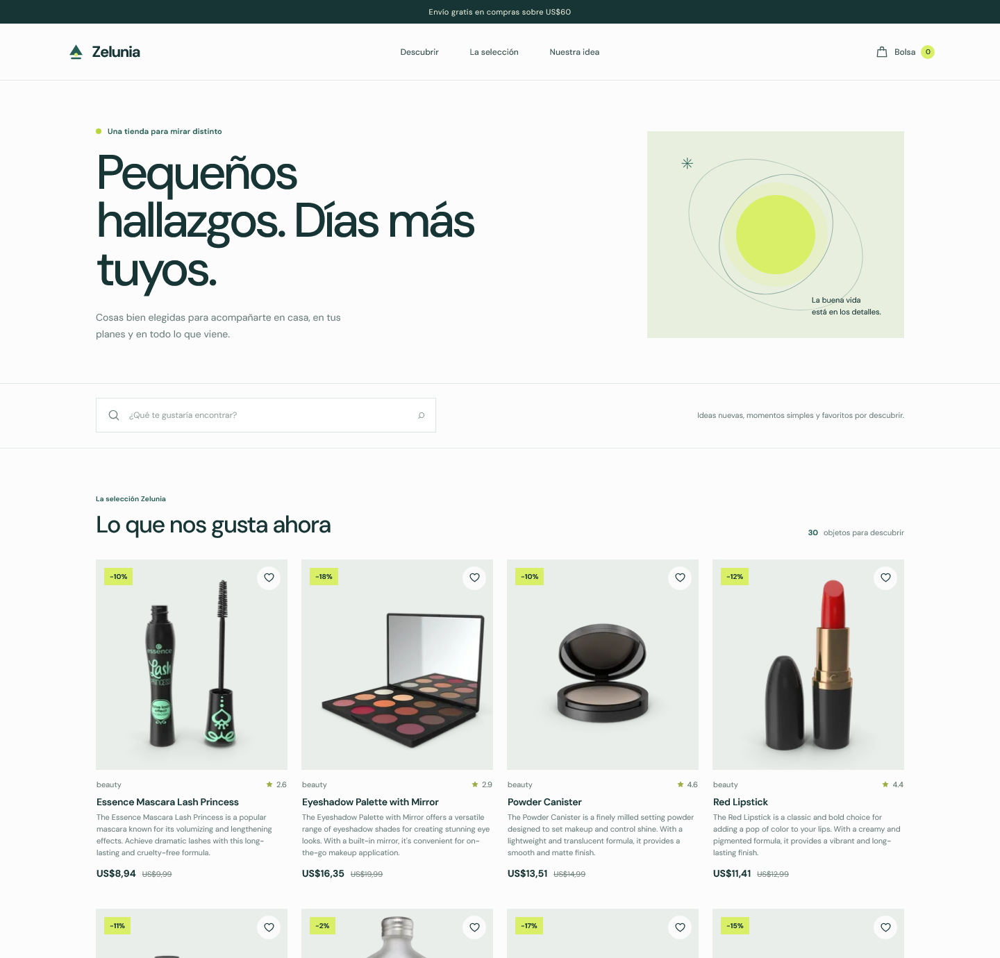
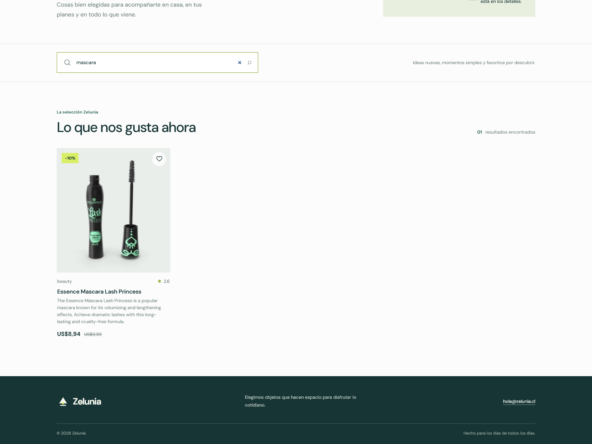

# Zelunia v1.0.0

Zelunia es una tienda en línea de productos para descubrir. Presenta un catálogo obtenido desde la API pública de [DummyJSON](https://dummyjson.com/docs/products), permite buscar productos por nombre y comunica los estados de carga, error y búsqueda sin coincidencias.

## Sitio web

[Visita Zelunia](https://ssaa96.github.io/Zelunia/)

## Capturas

### Vista general



### Búsqueda de productos



## Componentes

| Componente | Responsabilidad |
| --- | --- |
| `Header` | Muestra la marca Zelunia y la navegación principal. |
| `SearchBar` | Expone un campo de búsqueda controlado mediante props. |
| `ProductCard` | Presenta la imagen, categoría, calificación, descripción y precio de un producto recibido por props. |
| `ProductList` | Renderiza el catálogo como una lista de tarjetas de producto. |
| `Loader` | Informa que el catálogo se está cargando. |
| `ErrorMessage` | Explica el error de carga y permite volver a intentarlo. |
| `Footer` | Muestra información básica de Zelunia y un correo de contacto. |

## Tecnologías

- React 19
- TypeScript 6
- Vite 8
- CSS
- API REST de DummyJSON

## Requisitos

- Node.js 20.19 o superior, o 22.12 o superior.
- npm.
- Conexión a internet para consultar la API y cargar las imágenes de productos.

## Instalación y ejecución

Clona el repositorio, entra en la carpeta del proyecto e instala sus dependencias:

```bash
git clone https://github.com/SSAA96/Zelunia.git
cd Zelunia
npm install
```

Inicia el servidor de desarrollo:

```bash
npm run dev
```

Vite mostrará en la terminal la dirección local para abrir la tienda en el navegador.

## Comandos disponibles

```bash
npm run dev      # Inicia el servidor de desarrollo
npm run build    # Comprueba TypeScript y genera la versión de producción
npm run lint     # Revisa el código con ESLint
npm run preview  # Previsualiza la versión generada
```

## Catálogo y búsqueda

La aplicación solicita los productos a `https://dummyjson.com/products` con `fetch` dentro de `useEffect`. Mientras espera, presenta el indicador de carga; si la solicitud falla, muestra un mensaje con opción para reintentar. El buscador filtra por nombre sin distinguir mayúsculas y muestra una acción para volver al catálogo completo cuando no hay coincidencias.
